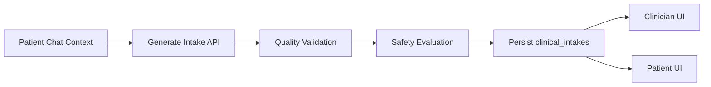

# Intake Architecture

## Single Source of Truth

- All intake persistence and version history live in `clinical_intakes`.
- `anamnesis_entries` is for clinician notes and is not used as the intake data source.
- Any adapter must be one-way from `clinical_intakes` to read-only views (none required today).

## Data Model

`clinical_intakes` fields used by the UI and API:

- `id` (uuid)
- `version_number`
- `status`
- `clinical_summary`
- `structured_data`
- `trigger_reason`
- `updated_at`

## Write Path

- Patient chat context -> `POST /api/clinical-intake/generate`
- Safety evaluation runs server-side and is stored in `structured_data.safety`
- New version written as a new row in `clinical_intakes`

## Read Paths

Clinician:
- Latest: `GET /api/clinician/patient/[patientId]/intake/latest`
- History: `GET /api/clinician/patient/[patientId]/intake/history`
- Version: `GET /api/clinician/patient/[patientId]/intake/version/[versionNumber]`

Patient:
- Latest: `GET /api/patient/intake/latest`

## Versioning Rules

- `version_number` is the primary ordering field for history.
- `updated_at` is used as secondary ordering for tie-breaking.
- UI uses the latest `version_number` for current intake.

## Trigger Rules (Config)

Intake trigger thresholds live in [lib/clinicalIntake/intakeTriggerRules.ts](../../../lib/clinicalIntake/intakeTriggerRules.ts).
Update this file to adjust minimum message count, max recent messages, or auto-trigger thresholds.

## Data Flow Diagram

