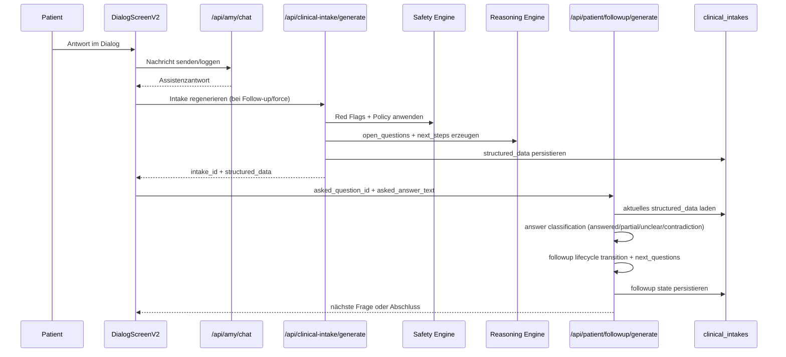

# CRE Component Interaction Schema (Stand 2026-02-15)

Ziel: Strukturelles Schema, wie die zentralen Komponenten im aktuellen Entwicklungsstand zusammenwirken.

## 1) Systemübersicht (Komponenten + Datenfluss)

```mermaid
flowchart TD
  subgraph UI[Patient UI]
    A[DialogScreenV2]
  end

  subgraph API[Patient APIs]
    B[/api/amy/chat]
    C[/api/clinical-intake/generate]
    D[/api/patient/followup/generate]
    E[/api/clinical-intake/latest]
  end

  subgraph CRE[CRE Core]
    F[LLM Prompt Layer\nlib/llm/prompts.ts]
    G[Safety Engine\nredFlags + policyEngine]
    H[Reasoning Engine\ngenerateReasoningPack]
    I[Follow-up Generator\ngenerateFollowupQuestions]
    J[Answer Classification\nclassifyFollowupAnswer]
  end

  subgraph DATA[Persistenz]
    K[(amy_chat_messages)]
    L[(clinical_intakes.structured_data)]
    M[(patient_events)]
    N[(clinical_reasoning_configs)]
    O[(safety rules/policy overrides)]
  end

  subgraph CLIN[Clinician]
    P[Studio UI Review/HITL]
    Q[Export JSON/FHIR/PDF]
  end

  A -->|User Turn| B
  B -->|log_only/full chat turn| K

  A -->|regenerate / force| C
  C -->|chat context lesen| K
  C --> F
  C --> G
  C -->|aktive Config laden| N
  C -->|Rule Overrides laden| O
  C --> H
  C -->|structured_data speichern| L
  C -->|events| M

  A -->|asked_question_id + answer| D
  D -->|latest intake lesen/schreiben| L
  D --> J
  D --> I
  D -->|events| M

  A --> E
  E -->|latest structured_data| L

  L --> P
  P --> Q
```

## 2) Laufzeitlogik (vereinfacht)



## 3) Steuerungsprinzipien (Soll aus CRE/SSOT)

- Safety ist führend: Eskalationslogik blockiert oder priorisiert unabhängig vom Reasoning.
- Reasoning liefert intern offene klinische Fragen; Follow-up setzt diese patientenfähig um.
- Follow-up darf beantwortete Fragen nicht erneut aktiv stellen (Loop-Invariante).
- HITL/Clinician bleibt Gate für klinische Finalisierung und Export.
- Telemetrie dokumentiert den Ablauf auditierbar über patient_events.

## 4) Aktueller struktureller Gap (aus Betriebssicht)

- Es fehlt ein explizites Objective/Slot-Modell für Anamnese-Bausteine mit Status (missing/answered/verified/blocked).
- Daher wird aktuell teils über Frage-/Antworttext indirekt gesteuert statt über stabile Ziel-IDs.
- Empfehlung für NV4: Slot-basierte Orchestrierung als führender Steuerungskern zwischen Reasoning und Follow-up.
